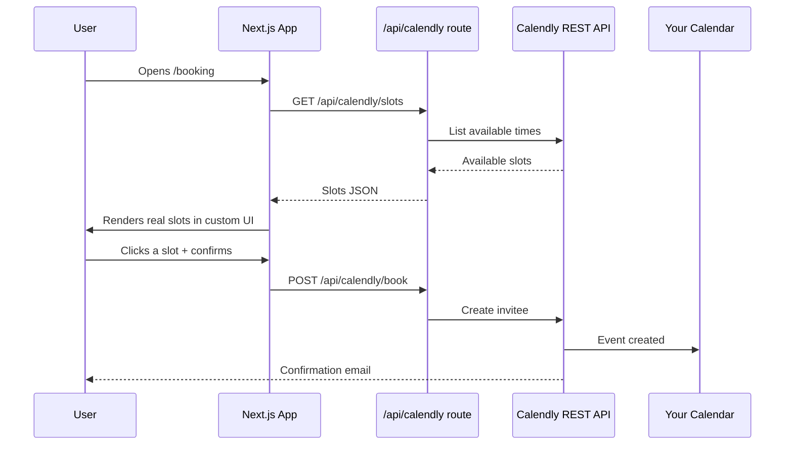
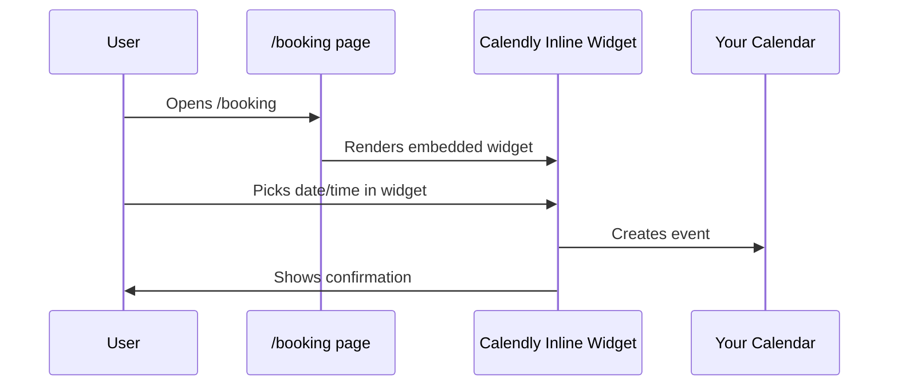

# Calendly Booking Integration -- Two Options

## Option A: Keep your custom UI + Calendly API (Paid plan required)

Keep the exact glassmorphic card, time-slot buttons, and "Bevestig je Afspraak" button from `[src/components/BookingHeroSection.tsx](src/components/BookingHeroSection.tsx)`, but make them functional by calling Calendly's REST API.




### What this requires

- **Calendly Professional plan** ($10/month) -- the free plan does not expose the scheduling API.
- **Personal Access Token** from Calendly Developer settings.
- **Two Next.js API routes** (server-side, keeps your token safe):
  - `src/app/api/calendly/slots/route.ts` -- calls `GET /event_type_available_times` to fetch real availability.
  - `src/app/api/calendly/book/route.ts` -- calls `POST /scheduled_events` (or uses the Calendly scheduling link with pre-filled data) to create the booking.
- **Update BookingHeroSection** to:
  - Fetch slots from `/api/calendly/slots` on mount (replace hardcoded `availableSlots` array).
  - On slot click + confirm, POST to `/api/calendly/book` with the selected time.
  - Show loading/success/error states.

### Env variables needed

```
CALENDLY_API_TOKEN=your_personal_access_token
CALENDLY_EVENT_TYPE_UUID=your_event_type_uuid
NEXT_PUBLIC_CALENDLY_URL=https://calendly.com/your-username/15min
```

### Pros/Cons

- **Pro**: Full control over UI -- your current design stays pixel-perfect.
- **Pro**: Seamless branded experience, no third-party iframe visible.
- **Con**: Requires Calendly paid plan.
- **Con**: More code to build and maintain (API routes, error handling, token management).
- **Con**: You must handle edge cases (timezone conversion, slot conflicts, rate limits).

---

## Option B: Keep left column + embed Calendly widget in the right card (Free plan works)

Keep the left column of `[src/components/BookingHeroSection.tsx](src/components/BookingHeroSection.tsx)` (heading, progress steps, trust badges, urgency message) exactly as-is. Replace only the right-column glassmorphic card with a Calendly inline embed, styled to match your dark theme.




### What this requires

- **Any Calendly plan** (free works).
- Add Calendly CSS + JS to `[src/app/layout.tsx](src/app/layout.tsx)`.
- Replace the right-column card content (lines ~270-333 in BookingHeroSection) with:

```tsx
<div className="relative rounded-3xl overflow-hidden bg-white/5 backdrop-blur-xl border border-white/10 shadow-2xl">
  <div
    className="calendly-inline-widget"
    data-url={`${process.env.NEXT_PUBLIC_CALENDLY_URL}?hide_gdpr_banner=1&background_color=1a1227&text_color=ffffff&primary_color=6a49ff`}
    style={{ minWidth: '320px', height: '500px' }}
  />
</div>
```

- The glassmorphic card wrapper stays, so the widget visually blends with the rest of the page.
- Calendly handles all booking logic, emails, and calendar sync.

### Env variables needed

```
NEXT_PUBLIC_CALENDLY_URL=https://calendly.com/your-username/15min
```

### Pros/Cons

- **Pro**: Works on free Calendly plan.
- **Pro**: Very little code -- no API routes, no token management.
- **Pro**: Calendly handles all edge cases (timezones, conflicts, confirmations).
- **Con**: The right side will look like Calendly's UI (themed but not fully custom).
- **Con**: Less control over the exact slot presentation.

---

## My recommendation

**Start with Option B.** It takes 15 minutes to implement, works on any Calendly plan, and gets you a fully functional booking page immediately. You can always upgrade to Option A later if you need pixel-perfect control over every element.

If you go with Option A later, the left column stays untouched -- you'd only be swapping the right column back from the embed to your custom card with real API data.